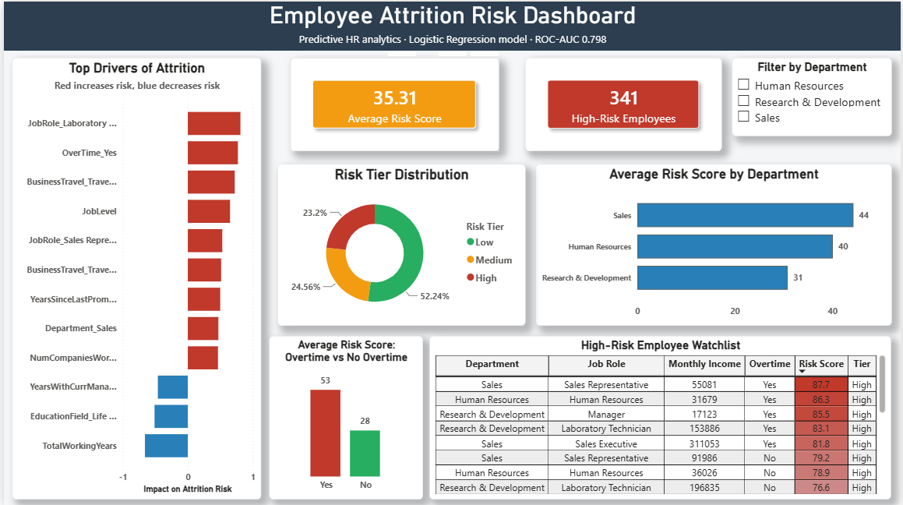

# Employee Attrition Risk Analysis

*Machine Learning • Classification • HR Analytics • Power BI*

> Predicting employee attrition before resignation using machine learning, with an interactive Power BI dashboard for HR decision-making.



## The Business Problem

Replacing an employee costs 6–9 months of that role's salary in hiring, onboarding, and lost productivity. Most HR teams only react after an employee resigns - there's no early warning system. This project builds one: every current employee is scored on attrition risk, so HR can prioritize retention conversations before it's too late.

## Project Highlights

- Built an end-to-end ML pipeline from EDA to deployment-ready risk scoring.
- Compared Logistic Regression and Random Forest using recall-focused evaluation.
- Engineered interpretable feature importance for HR decision-making.
- Developed an interactive Power BI dashboard to support data-driven HR decision-making.

**Dataset:** IBM HR Analytics Employee Attrition & Performance (1,470 anonymized employee records). A copy of the dataset is included in the `data/` directory for reproducibility.

## Key Findings

- **Overall attrition rate: ~16%**, but this varies sharply by segment rather than evenly across the company.
- **Overtime is the single strongest driver of attrition** - employees working overtime show an average risk score of 53 vs. 28 for those who don't, nearly double.
- **Job satisfaction and income both show a clear inverse relationship with attrition.**
- **Logistic Regression was selected as the production model over Random Forest** - despite lower raw accuracy (0.75 vs 0.83), it achieved dramatically better recall on actual leavers (0.62 vs 0.17) and a higher ROC-AUC (0.798 vs 0.763). In this problem, missing a real at-risk employee is far more costly than one unnecessary retention conversation, making recall the metric that matters most.

## Methodology

1. **Data quality audit** - confirmed zero missing values and zero duplicates; removed 3 constant columns (EmployeeCount, Over18, StandardHours) carrying no analytical signal.
2. **EDA** - explored attrition patterns across department, overtime, income, and satisfaction.
3. **Feature engineering** - one-hot encoded 7 categorical variables; standardized numeric features for the logistic model.
4. **Modeling** - compared Logistic Regression against Random Forest, both using class-weighted balancing to handle the ~5:1 class imbalance in the target variable.
5. **Model selection** - chose based on recall and ROC-AUC rather than raw accuracy, since accuracy is misleading on imbalanced data (a model predicting "stays" for everyone scores ~84% accuracy while being useless).
6. **Driver analysis** - extracted standardized coefficients from the production Logistic Regression model to identify which factors increase vs. decrease attrition risk, and by how much.
7. **Export** - scored the full employee population and exported a risk-tiered CSV for the Power BI dashboard.

## Business Impact

Using this workflow, HR teams can:

- Identify employees with elevated attrition risk before resignation.
- Prioritize retention discussions for high-risk employees.
- Understand the key drivers influencing attrition.
- Support data-driven workforce planning through an interactive dashboard.

## Why Class-Weighted Balancing, Not SMOTE

The dataset has roughly 5x more "stayed" than "left" employees. `class_weight='balanced'` was used rather than SMOTE (synthetic oversampling) because the dataset is small (1,470 rows), and SMOTE-generated synthetic employees risk introducing unrealistic feature combinations at this scale. Class weighting achieves comparable recall improvement without fabricating data.

## Dashboard

An interactive Power BI dashboard that enables HR teams to identify high-risk employees, understand the key drivers of attrition, and prioritize retention efforts through actionable insights.

**Key components:**
- KPI cards for average risk score and high-risk employee count, with conditional color formatting
- Risk tier distribution (donut) and department-level risk comparison
- Feature-direction chart highlighting factors that increase and decrease attrition risk
- Overtime vs. no-overtime risk comparison
- A sortable, filterable high-risk employee watchlist for HR action

## Tech Stack

| Layer | Tool |
|---|---|
| Data processing | Python, pandas |
| Modeling | scikit-learn (Logistic Regression, Random Forest) |
| Exploratory Analysis | matplotlib, seaborn |
| Dashboard | Power BI Desktop |
| Environment | Google Colab |

## Repository Structure

```text
employee-attrition-risk-analysis/
├── data/
├── notebooks/
├── assets/
├── powerbi/
├── README.md
└── requirements.txt
```

## How to Reproduce

```bash
git clone https://github.com/gandhiheer7/employee-attrition-risk-analysis.git
cd employee-attrition-risk-analysis
pip install -r requirements.txt
jupyter notebook notebooks/hr_attrition_analysis.ipynb
```

Open `powerbi/hr_attrition_dashboard.pbix` in Power BI Desktop to explore the dashboard, or view the static preview above.

## Author

**Heer Gandhi**

- [GitHub](https://github.com/gandhiheer7)
- [LinkedIn](https://www.linkedin.com/in/heer-gandhi)